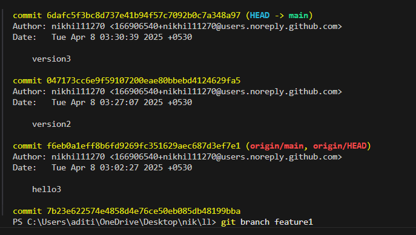
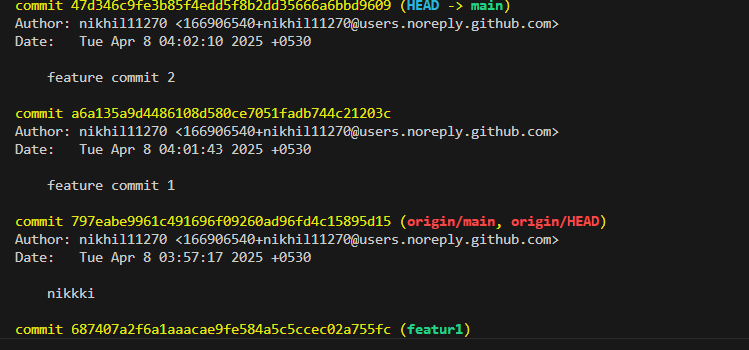
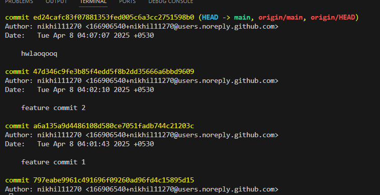
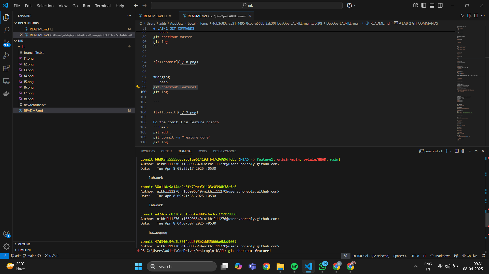
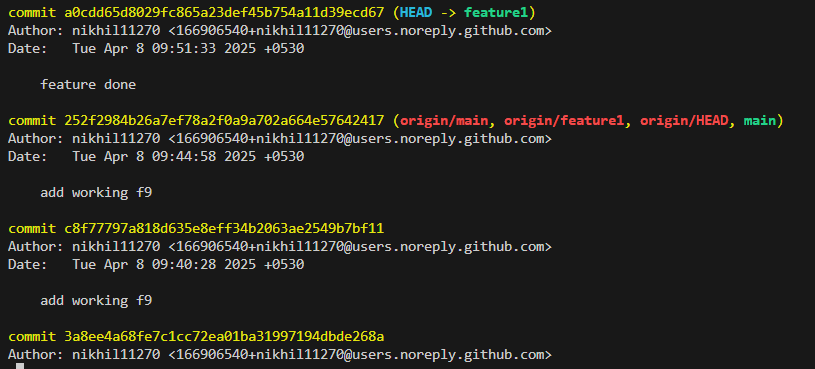
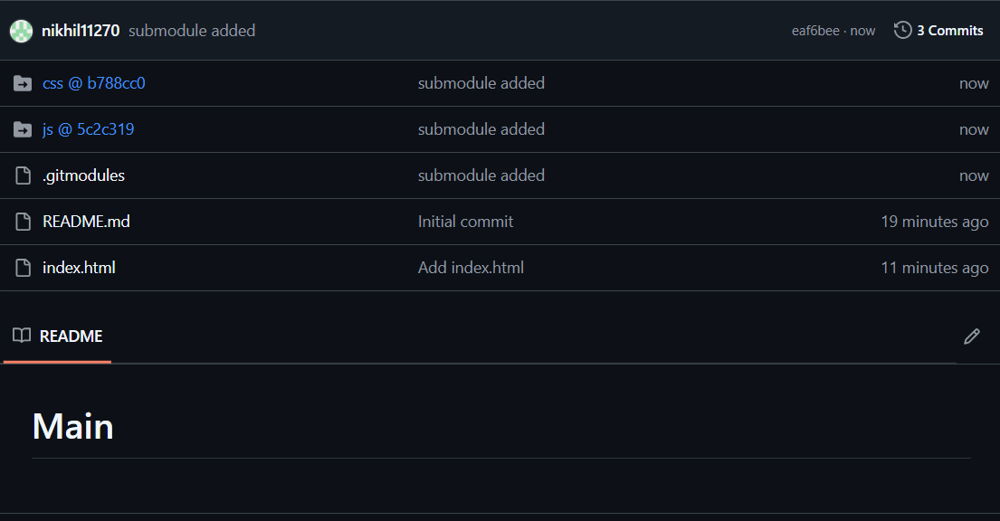

# LL
hi

```bash
git add .
git commit -m "figure 1"
git push
```


`git status`


> Final step done


> Checking the block code 

# LAB-2 GIT COMMANDS
*BRANCHING*


Create a file and do 3 commits in it
1st change
```bash
git add .
git commit -m "version1"
```
2nd change
```bash
git add .
git commit -m "version2"
```

3rd change
```bash
git add .
git commit -m "hello3"
```


View all commits by using git log

```bash
git log
```


```bash
git branch featur1
git log
```




CREATE NEW FILE AND ADD TWO COMMITS
```bash
git add.
git commit -m "feature commit 1"
```
```bash
git add.
git commit -m "feature commit 2"
```





```bash
git checkout main
git log
```





#Merging
```bash
git checkout feature1
git log

```



Do the comit 3 in feature branch
```bash
git add .
git commit -m "feature done"
git log

```



switching to master branch and perform merging
```bash
git checkout main
git merge feature1 -m "Merging featutre 1"
git log

```
open integrated terminal of MAIN repo
```bash
git submodule add https://github.com/SAGAR-SINGH-X-CUBE/JS.git css
git submodule add https://github.com/SAGAR-SINGH-X-CUBE/CSS.git css
git add .
git commit -m "submodule added"
git push

```


