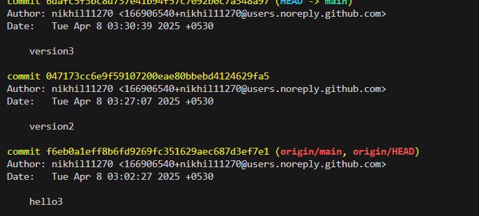
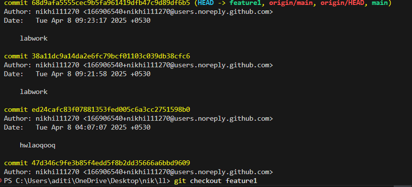

# LL
hi

```bash
git add .
git commit -m "figure 1"
git push
```


`git status`


> Final step done


> Checking the block code 

# LAB-2 GIT COMMANDS
*BRANCHING*


Create a file and do 3 commits in it
1st change
```bash
git add .
git commit -m "version1"
```
2nd change
```bash
git add .
git commit -m "version2"
```

3rd change
```bash
git add .
git commit -m "hello3"
```


View all commits by using git log

```bash
git log
```



```bash
git branch featur1
git log
```


CREATE NEW FILE AND ADD TWO COMMITS
```bash
git add.
git commit -m "feature commit 1"
```
```bash
git add.
git commit -m "feature commit 2"
```


```bash
git checkout main
git log
```


#Merging
```bash
git checkout feature1
git log

```



Do the comit 3 in feature branch
```bash
git add .
git commit -m "feature done"
git log

```


<<<<<<< HEAD
switching to master branch and perform merging
=======
switching to main branch and perform merging
>>>>>>> 41b0b7c453cc3b0cbd948cfaaabdce4125577f69
```bash
git checkout main
git merge feature1 -m "Merging featutre 1"
git log

```
<<<<<<< HEAD
open integrated terminal of MAIN repo
```bash
git submodule add https://github.com/SAGAR-SINGH-X-CUBE/JS.git css
git submodule add https://github.com/SAGAR-SINGH-X-CUBE/CSS.git css
git add .
git commit -m "submodule added"
git push

```


=======


>>>>>>> 41b0b7c453cc3b0cbd948cfaaabdce4125577f69

#Hosting Submodule
Create a repository with the same name as github username
*SAGAR-SINGH-X-CUBE.github.io*
Go to your repository: SAGAR-SINGH-X-CUBE.github.io
Click on "Settings" → "Pages"
Under "Branch," select main.
Click "Save."


#SUBVERSION


>CREATE A REPOSITORY
```bash
sudo mkdir -p /var/svn/repos
sudo svnadmin create /var/svn/repos/myrepo

```
>Confgure SVN Server
```bash
sudo nano /var/svn/repos/myrepo/conf/svnserve.conf

```


```bash
anon-access = none      # Disable anonymous access
auth-access = write     # Allow authenticated users to write
password-db = passwd    # Use the passwd file for authentication


```


>SET UP THE USER
```bash
sudo nano /var/svn/repos/myrepo/conf/passwd

```

```bash
alice = alicepassword
bob = bobpassword
```


>START SVNSERVER

```bash
sudo svnserve -d -r /var/svn/repos

```

>Restart the server
```bash
sudo pkill svnserve
```

```bash
sudo pkill svnserve
```

```bash
cd /path/to/repo/conf/
cd /var/svn/repos/myrepo/conf/
svnserve -d -r /var/svn/repos/

```

>CLIENT SIDE
```bash
svn checkout svn://localhost/myrepo --username alice
cd myrepo

echo "Hello, SVN!" > file.txt
svn add file.txt
svn commit -m "Added file.txt"
svn update
svn status
svn log

```

# FORK


# DOCKER

```bash
docker -v

```

```bash
docker pull hello-world

```

```bash
docker images

```


```bash
docker run hello-world
```


```bash
docker run -it ubuntu

```


```bash
docker ps -a

```


